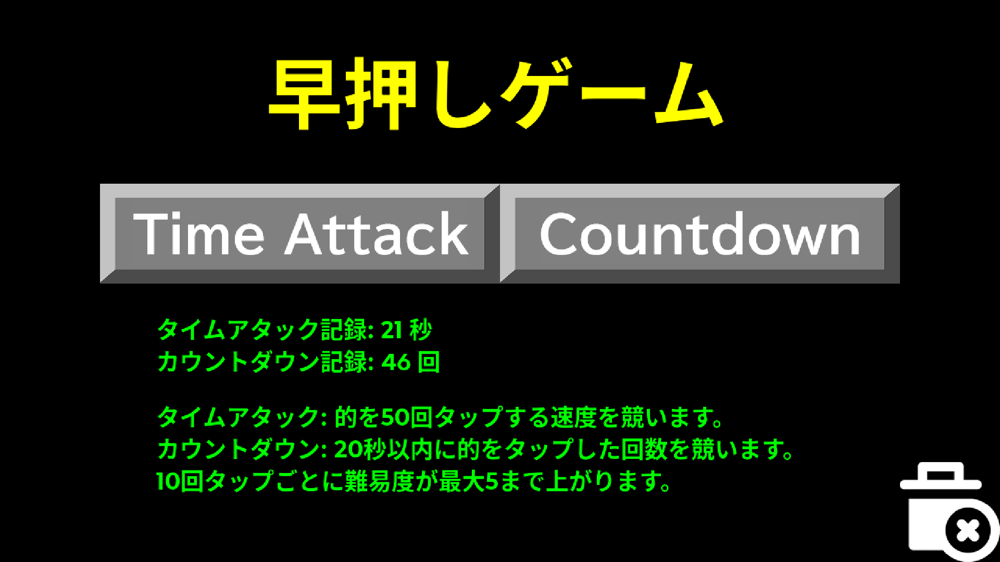
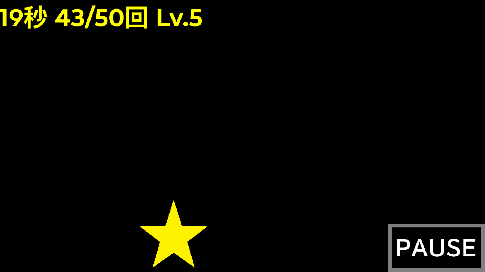

# 早押しゲーム

ランダムに現れる的を素早くクリック／タップする、モグラ叩き的なシンプルなゲームで、タイムアタックモードとカウントダウンモードを収録しています。10 回ごとにレベルが最大 5 まで上がり、レベル 2 以降ではレベルに応じた速度で的が動きます。最高記録の初期化は、Android 版はタイトル画面右下のごみ箱アイコンから行い、Windows 版は実行ファイルと同じ場所に作成される `save.bin` を削除するだけです（レジストリなどは使用しません）。Web 版はリロードすれば消えます。

## 対応環境

Linux 環境では、HSP3Dish 版スクリプトの文字コードを UTF-8 に変換すれば [Linux 版ランタイム](https://hsp.tv/make/hsp3linux_pi.html)で動作しますが、導入手順が煩雑なため Wine で Windows 版を実行するか Web 版を使う方が手軽です（macOS も同様）。HSP3Dish 版は本来 iOS/iPadOS にも対応していますが、私がビルド環境もテスト環境も持ち合わせないため作成していません（そもそも野良配布できないし...）。

- Windows XP 以降の日本語版
  - 開発環境の制約上、日本語ロケールでしか正しく動作しません
- Android 5 以降
  - Play Store 等では公開していないので、提供元不明アプリのインストールを有効化した上で、APK からインストールしてください
- 新しめの Web ブラウザ [Experimental]
  - Web 版は「とりあえずビルドしてみた」程度で、環境によってはうまく動かない場合があります
  - 画面をはみ出す環境では全画面モードがおすすめです（縦方向に画面が余ると文字表示が壊れるので、横長状態で全画面化してください）

[Releases](../../releases) から適切なものをダウンロードしてください。Web 版は <https://watamario15.github.io/speedtap/> で遊べます（ロードにそこそこ時間が掛かります）。

## フォルダ構成

- [`assets/`](assets/): Windows 版で使う素材
- [`data/`](data/): HSP3Dish (Android/Web) 版で使う素材（Android ビルド時は Android プロジェクトの `app/src/main/assets/` に配置）
- [`res/`](res/): Android アプリアイコン（Android ビルド時は Android プロジェクトの `app/src/main/res/` に配置）
- [`app.ico`](app.ico): Windows アプリアイコン
- [`SpeedTap.hsp`](SpeedTap.hsp): HSP3Dish (Android/Web) 版ソースコード
- [`SpeedClick.hsp`](SpeedClick.hsp): Windows 版ソースコード

ソースコードは [Hot Soup Processor 3](https://hsp.tv) のスクリプトエディタで開けます。一般のテキストエディタを使う場合は Shift_JIS (CP932) で開いてください。

## 各種素材

本作品は元は高校時代に練習で作ったものですが、著作権上マズい素材をふんだんに使っていたので、公開にあたり全て置き換えています。

音声素材は、以下の通り [OtoLogic](https://otologic.jp) にて [CC BY 4.0](https://creativecommons.org/licenses/by/4.0/deed.ja) で配布されているものです。効果音は適宜形式変換やカット編集を施しています。

- タイトル BGM（`title.mp3`）：[ドタバタパニック](https://otologic.jp/free/bgm/wood_mallet01.html)
- プレイ中 BGM（`bgm.mp3`）：[ドタバタレース](https://otologic.jp/free/bgm/pop-music-synth01.html)
- 結果画面 BGM（`result.mp3`）[知恵の輪](https://otologic.jp/free/bgm/electronica01.html)
- 記録初期化画面 BGM（`config.mp3`）：[Specification](https://otologic.jp/free/bgm/electronica01.html)（Android 版のみ）
- 的クリック効果音（`ok.wav`）：[サイバー 18](https://otologic.jp/free/se/cyber02.html)
- カウントダウン効果音（`countdown.wav`, `go.wav`）：[カウントダウン 01](https://otologic.jp/free/se/countdown01.html)
- 一時停止効果音（`pause.wav`）：[サイバー 17](https://otologic.jp/free/se/cyber02.html)

画像素材は以下の通りです。

- 的（`target.png`）：ペイントで適当に作ったもので、Public Domain ([CC0-1.0](LICENSE)) とします（Windows 版はこれだけ）
- ゴミ箱（`reset.png`）：[SVG Repo](https://www.svgrepo.com/) で CC0-1.0 で配布されている [Delete SVG Vector](https://www.svgrepo.com/svg/171102/delete) です
- その他ボタン類：ペイントで適当に作ったものですが、文字は [OFL-1.1](https://openfontlicense.org/) で提供される [BIZ UDPGothic](https://github.com/googlefonts/morisawa-biz-ud-gothic) を使用しています（私の作業分については著作権を主張しません）

## 著作権

ソースコードは著作権を放棄し Public Domain ([CC0-1.0](LICENSE)) で配布します。画像素材・音声素材は前節の通りです。
