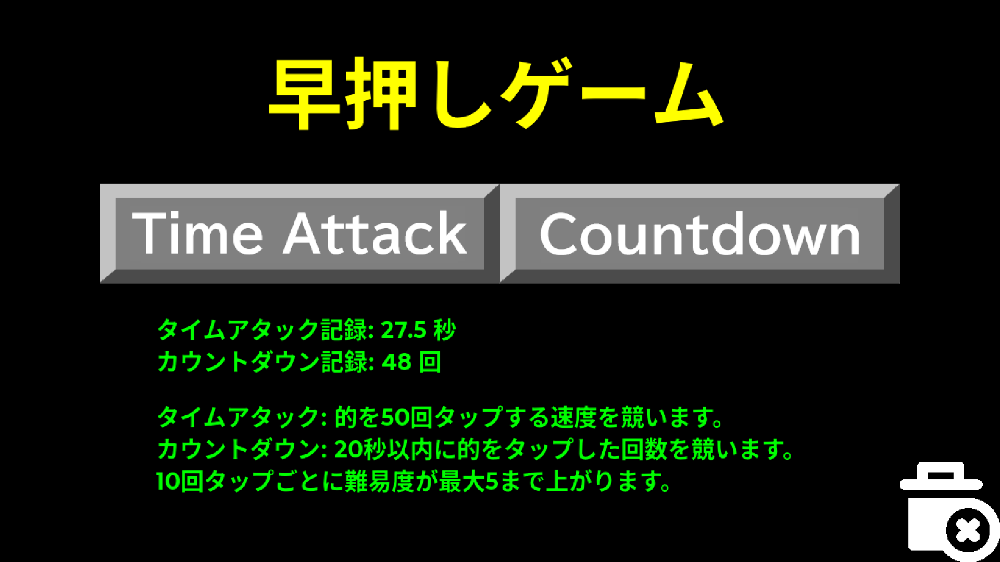
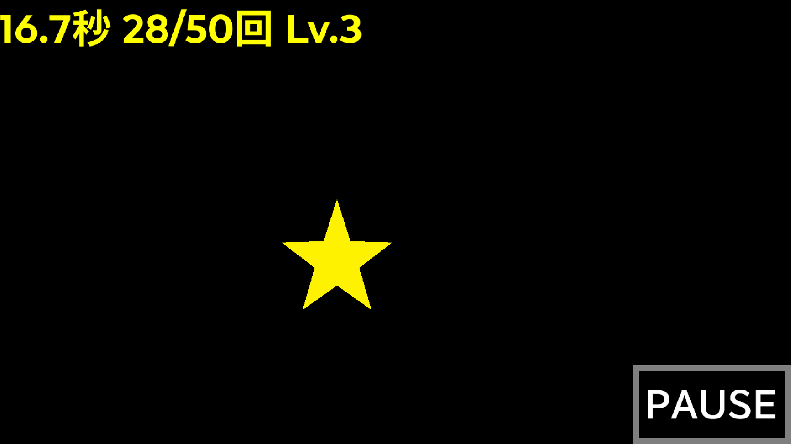
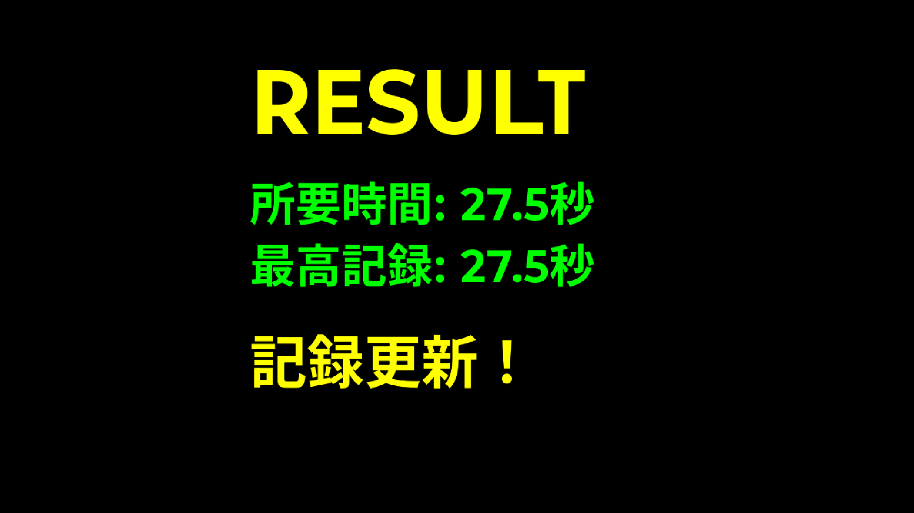

# Speed Tap

**English** | [日本語](README-ja.md)

A simple whac-a-mole-style game where you quickly click or tap randomly appearing targets. It includes both a Time Attack mode and a Countdown mode. The level increases every 10 hits, up to a maximum of Level 5. From Level 2 onward, the targets move at speeds based on the current level.

To reset high scores:
- On Android, tap the trash can icon at the bottom-right of the title screen.
- On Windows, simply delete the `save.bin` file created in the same directory as the executable (no registry entries are used).
- On the Web version, reloading the page will clear the records.

## Supported Platforms

On Linux, the game can run with the [HSP3Dish Linux runtime](https://hsp.tv/make/hsp3linux_pi.html) if the script encoding is converted to UTF-8. However, it is generally easier to run the executable through Wine or use the Web version instead (the same applies to macOS) as the setup process is rather complicated. Although the development environment supports iOS/iPadOS, no such version has been built as I do not have either a build or testing environment for them (besides, unofficial distribution is not really possible anyway...).

- Japanese versions of Windows XP or later
  - Due to development environment limitations, the game only works correctly under a Japanese locale
- Android 5 or later
  - Since the app is not distributed through the Play Store or similar services, you must enable installation from unknown sources and install it manually from the APK (installation via ADB is also possible)
- Modern web browsers [Experimental]
  - The Web version was basically built “just to see if it works,” so it may not work properly depending on the environment
  - Use fullscreen mode if the game extends beyond the screen (play in landscape orientation as text rendering may break if there is too much vertical space)

Download the appropriate version from [Releases](../../releases). The Web version can be played at <https://watamario15.github.io/speedtap/> (loading may take a little while).

## Folder Structure

- [`assets/`](assets/): Assets used by the Windows version
- [`data/`](data/): Assets used by the HSP3Dish (Android/Web) versions (placed in `app/src/main/assets/` when building for Android)
- [`res/`](res/): Android app icons (placed in `app/src/main/res/` when building for Android)
- [`app.ico`](app.ico): Windows application icon
- [`SpeedTap.hsp`](SpeedTap.hsp): Source code for the HSP3Dish (Android/Web) version
- [`SpeedClick.hsp`](SpeedClick.hsp): Source code for the Windows version

The source code can be opened with the script editor included in [Hot Soup Processor 3](https://hsp.tv/) (the latest version including beta versions is recommended for HSP3Dish building). Use Shift_JIS (CP932) encoding for opening if you prefer a third-party editor.

## Assets

This project was originally created as personal practice during high school, but it used many copyrighted materials that could not legally be redistributed. All such assets have been replaced for this public release.

The audio assets listed below are distributed under the [CC-BY-4.0](LICENSE.OtoLogic) from [OtoLogic](https://otologic.jp/). Sound effects were converted or trimmed as needed.

- Title screen BGM (`title.mp3`): [Dotabata Panic](https://otologic.jp/free/bgm/wood_mallet01.html)
- In-game BGM (`bgm.mp3`): [Dotabata Race](https://otologic.jp/free/bgm/pop-music-synth01.html)
- Result screen BGM (`result.mp3`): [Puzzle Ring](https://otologic.jp/free/bgm/electronica01.html)
- Record reset screen BGM (`config.mp3`, Android version only): [Specification](https://otologic.jp/free/bgm/electronica01.html)
- Target hit sound (`ok.wav`): [Cyber 18](https://otologic.jp/free/se/cyber02.html)
- Countdown sounds (`countdown.wav`, `go.wav`): [Countdown 01](https://otologic.jp/free/se/countdown01.html)
- Pause sound (`pause.wav`): [Cyber 17](https://otologic.jp/free/se/cyber02.html)

The image assets are as follows:

- Target (`target.png`): Created casually in MS Paint and released into the public domain under [CC0-1.0](LICENSE) (This is the only image used in the Windows version)
- Trash can (`reset.png`): [Delete SVG Vector on SVG Repo](https://www.svgrepo.com/svg/171102/delete), distributed under CC0-1.0
- Other buttons and UI elements: Also created casually in MS Paint. The text uses [BIZ UDPGothic](https://github.com/googlefonts/morisawa-biz-ud-gothic), distributed under the [SIL Open Font License 1.1](https://openfontlicense.org/). I do not claim copyright over my own contributions to these assets.

## Copyright

The source code is released into the public domain under [CC0-1.0](LICENSE). Image and audio assets are licensed as described in the previous section.
